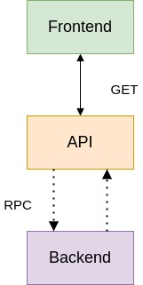

# Thales-AIR-Lab-Tech-Challenge

## Architecture



### Frontend

- Framework: Vue.js
    - Component: STARSANDSIDS.vue

### API Endpoints

- Written in Python
- Framework: FastAPI
- Functions:
    - GET /STARS-AND-SIDS

### Backend

- Written in Python
- Functions:
    - RetrieveAirports()
    - RetrieveSID(icao)
    - RetrieveSTARs(icao)
    - CalculateTopWaypoints()
    - RetrieveSTARsSIDs()

### Message Queue

- RabbitMQ
    - RPC

## Build

```sh
docker-compose build
```

## Run

```sh
docker-compose up -d
```